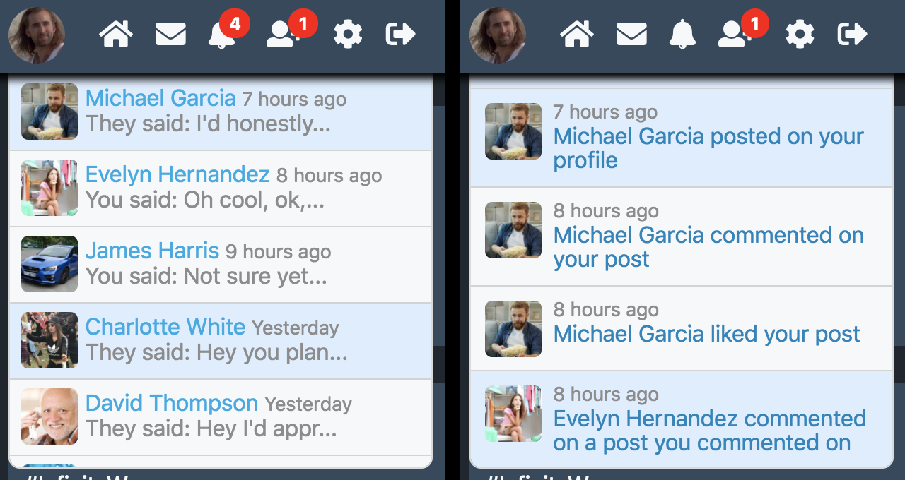
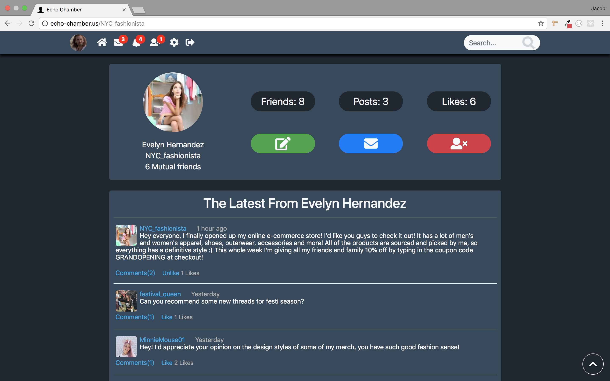
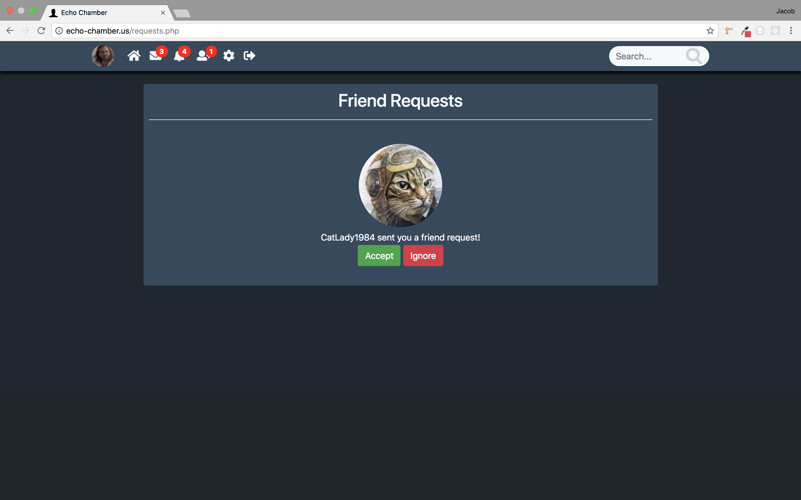
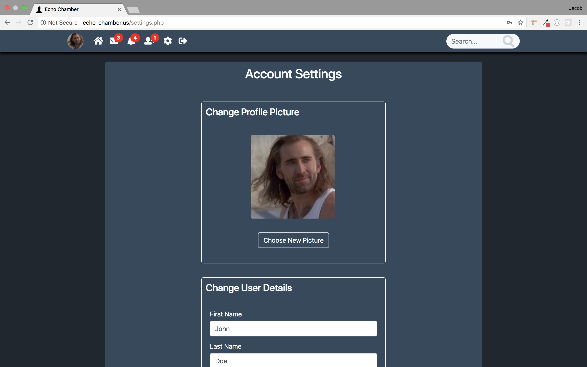
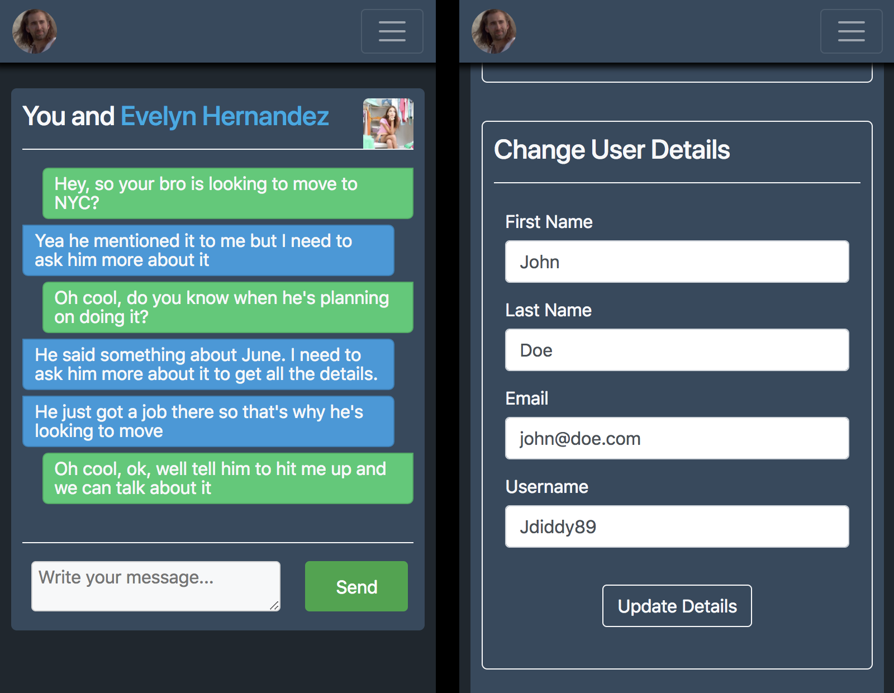

# Echo-Chamber
This is a Social Media Web App I made using a handful of different technologies and coding languages. The website functions much in the same way that many other social media sites like Facebook and Twitter function. A user can create an account, connect with friends, post on their profile, have a newsfeed of posts added by friends, in-app messaging, and many more features. I named it "Echo-Chamber" as a fun tongue-in-cheek jab at modern social media culture.

The specific languages and frameworks I used to build this app are: HTML, CSS, JavaScript, PHP, MySQL, jQuery, AJAX, and Bootstrap.

---

- The first thing the user will see when going to echo-chamber.us is the login page for the site. If the user has an account they can log into the site, if they do not have an account they can click the link to create a new account and the form will add the neccessary input fields for them to create a new account.

- Once a user logs in they will be brought to thier Newsfeed. On the top of the page is a navigation bar much like many other sites, with notification badges indicating the number of friend requests, notifications, and messages they have. On the right side of the body they will see their Newsfeed which is up to date with the latest posts of their friends and themselves. On top of the Newsfeed is a form where the user can add a new post of text, embedded youtube video, picture, or a combination of the three. On the left of the body is a panel with the profile picture and stats of the user and underneath is a panel which automatically calculates the top trending topics on the site.

- Notifications

- Messages

- Single Post

- Profile

- Friend Request

- Settings

- Search Results

- Mobile Newsfeed / Mobile Profile

- Mobile Navigation / Mobile Search

- Mobile Message / Mobile Settings

