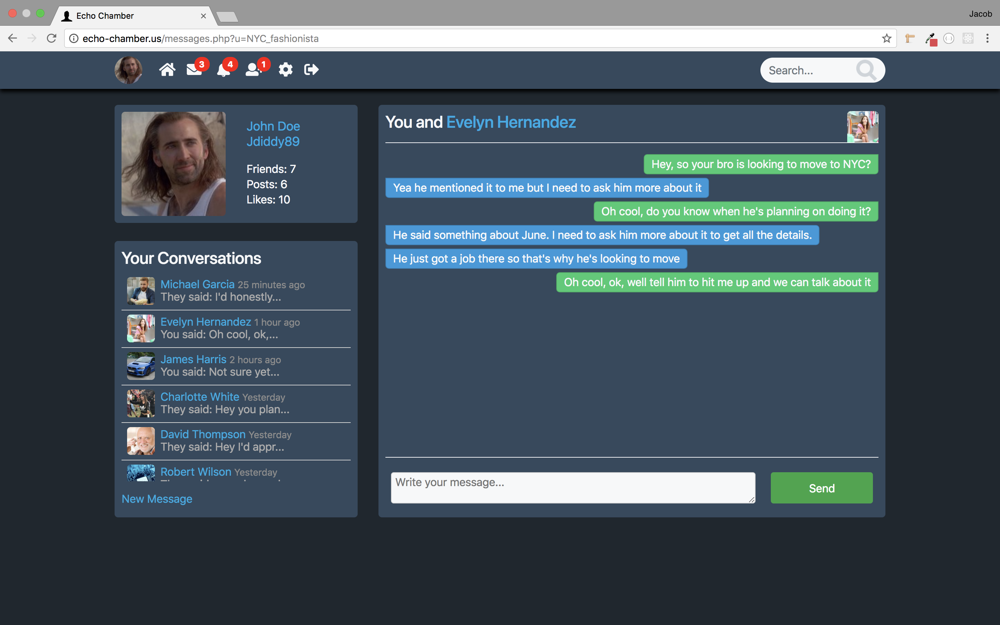
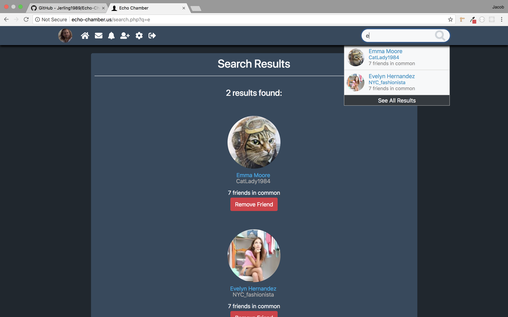

# Echo-Chamber
This is a Social Media Web App I made using a handful of different technologies and coding languages. The website functions much in the same way that many other social media sites like Facebook and Twitter function. A user can create an account, connect with friends, post on their profile, have a newsfeed of posts added by friends, in-app messaging, and many more features. I named it "Echo-Chamber" as a fun tongue-in-cheek jab at modern social media culture.

The specific languages and frameworks I used to build this app are: HTML, CSS, JavaScript, PHP, MySQL, jQuery, AJAX, and Bootstrap.

---

- The first thing the user will see when going to echo-chamber.us is the login page for the site. If the user has an account they can log into the site, if they do not have an account they can click the link to create a new account and the form will add the neccessary input fields for them to create a new account.

- Once a user logs in they will be brought to thier Newsfeed. On the top of the page is a navigation bar much like many other sites, with notification badges indicating the number of friend requests, notifications, and messages they have. On the right side of the body they will see their Newsfeed which is up to date with the latest posts of their friends and themselves. On top of the Newsfeed is a form where the user can add a new post of text, embedded youtube video, picture, or a combination of the three. On the left of the body is a panel with the profile picture and stats of the user and underneath is a panel which automatically calculates the top trending topics on the site.

- Below is an example of the dropdown panel that loads with the information on the user's latest notifications when they click the corresponding icons on the navigation bar. The image on the left shows the information from clicking on the messages icon, the image on the right shows the information from clicking on the bell icon. With both panels the unviewed items will display with a light blue background while the items that were already viewed display with a white background.

- When the user clicks on one of the message notifications they will be directed to a page where they are having a message exchange with that friend. On the left of the page is a panel with links to all of the different conversations the user is having with different friends. The user can create a new message with a friend they haven't had a conversation with yet by clicking on the link at the bottom of the conversations panel. They can also open up a message with any one of their friends but clicking on the message icon on that friend's profile page.

- When the user clicks on one of the bell notifications they will be directed to a page where the specific post that the notification is regarding will be displayed.

- Below is a view of one of the user's friend's profile page. The top left of the profile has the friend's profile picture, first and lastname, screen name, and amount of mutual friends you share. The rest of the top panel contains the friends profile stats, and button icons for different functions. The user can post on their friends profile, message the friend, or delete that friend. If the user is on the page of someone they are not already friends with they have the option to send a friend request or respond to a friend request that may have been sent to the user. Below the top panel with the user info and icons is the feed specific to that friend's profile. 

- Clicking on the new friend icon will bring the user to the friend requests page where they can see what requests they have and choose to either Accept or Ignore each new friend request.

- On the settings page the user will have a number of options to customize their profile. They can select and crop a new profile pic, change first and lastname, change screen name, change email address, or create a new password. The user also has the option to close thier account, if the user does close their account they can re-activate it by signing back into to app.

- Search Results

- Mobile Newsfeed / Mobile Profile

- Mobile Navigation / Mobile Search

- Mobile Message / Mobile Settings

